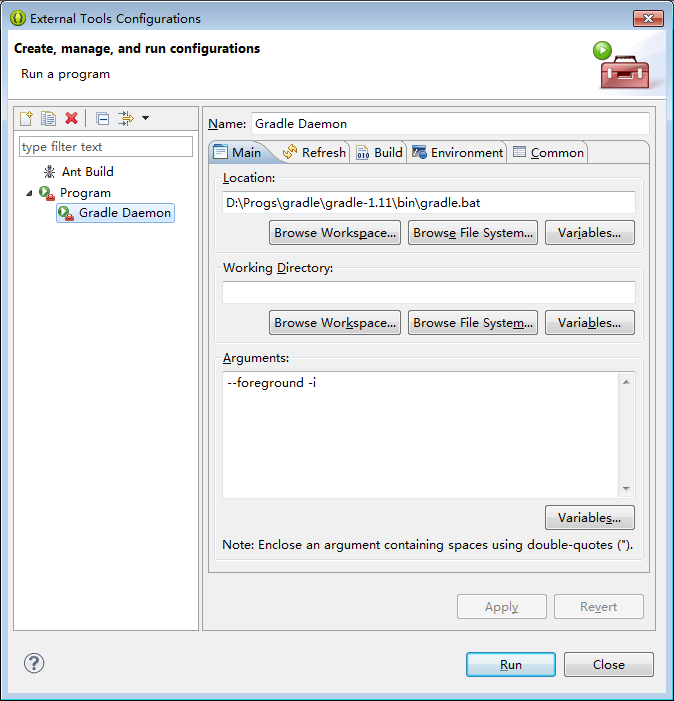
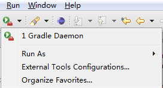

## org.nodeclipse.enide.gradle

`build.gradle` Run As Gradle GUI

- Minisite <http://www.nodeclipse.org/enide/gradle/>
- GitHub <https://github.com/Nodeclipse/nodeclipse-1/tree/master/org.nodeclipse.enide.gradle>

*Description*:  
Right-click any `.gradle` file, and select `Run As -> Gradle GUI`

To run/execute with gradle add this to `build.gradle`  

	task execute(type:JavaExec) {
	   main = mainClass
	   classpath = sourceSets.main.runtimeClasspath
	}

then execution is via

	gradle execute -PmainClass=runclass.RunClass 

see [Gradle to execute Java class (without modifying build.gradle)](http://stackoverflow.com/questions/21358466/gradle-to-execute-java-class-without-modifying-build-gradle)

### Jetty

As with Maven, your `build.gradle` should have jetty configuration 
to enable `gradle jetty:run` Gradle start.

### Daemon

see [Chapter 19. The Gradle Daemon](?), [Appendix D. Gradle Command Line](?)

Use Gradle daemon to speed up sequential gradle execution:

launch `gradle --foreground -i` in a shell or configure Eclipse external tool:

  

### Developing 

1. `git clone`;
2. import this project and `org.nodeclipse.common` (2) in Eclipse with PDE (e.g. Eclipse SDK/Classic)
 as "Existing Projects into Workspace".

maven build is optional for full build with other plugins.

#### Some links

- [When Runtime.exec() won't](http://www.javaworld.com/article/2071275/core-java/when-runtime-exec---won-t.html)

> Because some native platforms only provide limited buffer size for standard input and output streams, 
failure to promptly write the input stream or read the output stream of the subprocess may cause the subprocess to block, and even deadlock.

	"C:\Program Files\Java\jdk1.7.0_25/bin/java.exe"    "-Dorg.gradle.appname=gradle" -classpath "D:\Progs\gradle-1.10\lib\gradle-launcher-1.10.jar" org.gradle.launcher.GradleMain

Java without IDE
<http://www.cs.swarthmore.edu/~newhall/unixhelp/debuggingtips_Java.html>

<http://stackoverflow.com/questions/502494/execute-a-java-program-from-our-java-program>

	

