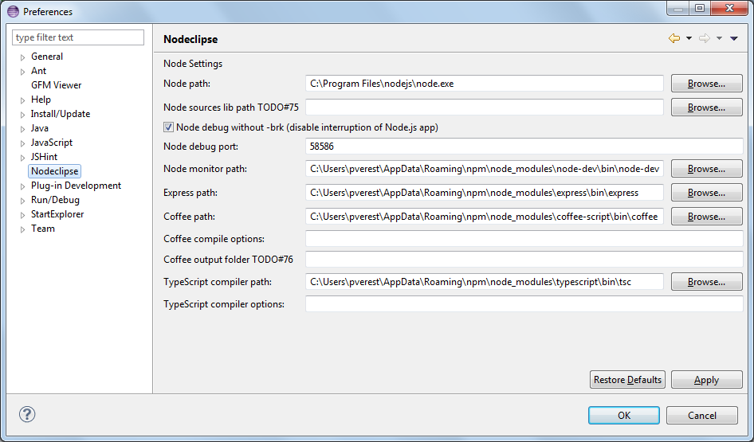

Title:  Nodeclipse Online Help - Configuration  

## Configuration

Some recommended configuration (These steps are needed for every new workspace):

Goto Window->Preferences 

General select Show heap status  
General->Workspace -> Text file encoding select other UTF-8  
(if Eclipse 4.x Chrome Theme (Optional) installed)  
General->Appearance ->Theme select Jeeeyul's themes - Chrome Theme, restart Eclipse  
Team -> Git -> History : Check "Follow renames"  

Switch to Node perspective (e.g. Window -> Open Perspective -> Other ... -> Node)

Window -> Show View -> Other... -> REST Client -> REST Client Tool

REST Client Tool is also nice to use in Debug perspective.

### Preferences

Check preferences ( Window -> Preferences ) for Node.js related settings.

## In previous versions

### Before 0.6

Window -> Show View -> Other... -> GFM Support -> GFM View  
(Very useful when exploring <code>node_modules</code> folders) 

#### File associations

Window -> Preferences -> General -> Editors -> File Associations <kbd>Add...</kbd>

- *.jade - associate with Scrapbook (from JDT)
- *.ejs - associate with HTML Editor (from WebTools, Aptana, etc)

#### [NTS](http://www.nodeclipse.org/nts/) Only

Window -> Show View -> Other... -> MiniMap -> MiniMap
  
### Before 0.4
  
Window -> Show View -> Other... -> Markdown -> Markdown HTML Preview  
(Very useful when exploring <code>node_modules</code> folders) 

