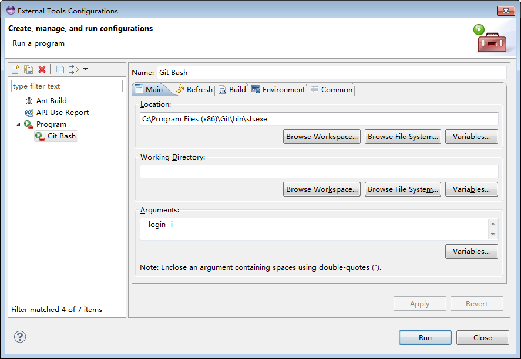
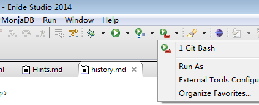
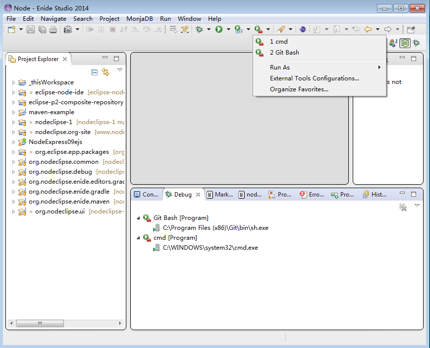

Title:  Nodeclipse Help - External Tools

## External Tools

add `External Tool Configuration` 
  

via `Run` menu or `External Tools` icon

Launched programs are visible in `Debug` View.

Hints.

1. On Windows your `cmd` path likely is `C:\WINDOWS\system32\cmd.exe`
2. [Git for Windows](http://msysgit.github.io/) comes with great bash shell. 
 On Windows by default path is like `C:\Program Files (x86)\Git\bin\sh.exe`, add `--login -i` to Arguments.

<pre><code>
>"C:\Program Files (x86)\Git\bin\sh.exe" --help
GNU bash, version 3.1.0(1)-release-(i686-pc-msys)
Usage:  "C:/Program Files (x86)/Git/bin/sh.exe" [GNU long option] [option] ...
        "C:/Program Files (x86)/Git/bin/sh.exe" [GNU long option] [option] script-file ...
GNU long options:
        --debug
        --debugger
        --dump-po-strings
        --dump-strings
        --help
        --init-file
        --login
        --noediting
        --noprofile
        --norc
        --posix
        --protected
        --rcfile
        --restricted
        --verbose
        --version
        --wordexp
Shell options:
        -irsD or -c command or -O shopt_option          (invocation only)
        -abefhkmnptuvxBCHP or -o option
Type `"C:/Program Files (x86)/Git/bin/sh.exe" -c "help set"' for more information about shell options.
Type `"C:/Program Files (x86)/Git/bin/sh.exe" -c help' for more information about shell builtin commands.
Use the `bashbug' command to report bugs.
</code></pre>
