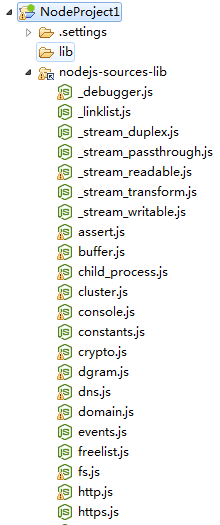

Title:  Nodeclipse Help - Node.js

# Node.js

Of course <http://nodejs.org/> .

Sources at GitHub <https://github.com/joyent/node/> .

## Node.js

<pre><code>
$ node -h
Usage: node [options] [ -e script | script.js ] [arguments]
       node debug script.js [arguments]

Options:
  -v, --version        print node's version
  -e, --eval script    evaluate script
  -p, --print          evaluate script and print result
  -i, --interactive    always enter the REPL even if stdin
                       does not appear to be a terminal
  --no-deprecation     silence deprecation warnings
  --trace-deprecation  show stack traces on deprecations
  --v8-options         print v8 command line options
  --max-stack-size=val set max v8 stack size (bytes)

Environment variables:
NODE_PATH              ';'-separated list of directories
                       prefixed to the module search path.
NODE_MODULE_CONTEXTS   Set to 1 to load modules in their own
                       global contexts.
NODE_DISABLE_COLORS    Set to 1 to disable colors in the REPL

Documentation can be found at http://nodejs.org/
</code></pre>


<pre><code>
$ node -p "process.versions"
{ http_parser: '1.0',
  node: '0.10.0',
  v8: '3.14.5.8',
  ares: '1.9.0-DEV',
  uv: '0.9',
  zlib: '1.2.3',
  openssl: '1.0.1e' }
</code></pre>

### Node.js instances

Nodeclipse lets you define exact location of Node.js installations, or with checkbox "just node" let OS to find `node`
on current PATH.

Hint: if you have 2 or more Node.js instances, let the newest be on PATH and select older in "Node path:".
Then by checking/unchecking "just node" you can switch to and from the newest Node.js.

### Node.js sources

If you got Node.js via pre-built installer, visit <http://www.nodejs.org/download/> again to get Node.js sources
and extract archive to a folder. Now you also have local copy of API documentations.

Node.js sources have "Node.js Core Modules" in `lib` folder, that may be useful.

Add following snippet to project `.project` file to reference Node.js sources.

```xml
	<linkedResources>
		<link>
			<name>nodejs-sources-lib</name>
			<type>2</type>
			<location>E:/Enide/node-sources/node-v0.10.19/lib/</location>
		</link>
	</linkedResources>
``` 

(This is done automatically if Node.js sources are selected since Nodeclipse 0.9)

 


### Node.js modules

Node.js modules (in `node_modules`) usually have `README.md` file.
To see `README.md` as it looks like on GitHub, right-click it and select `Show in GFM view`.
Check also "Markdown" and "Github Flavored Markdown (GFM)" help pages.

### Example

```javascript
	var http = require('http');
	var server = http.createServer();
	var handleReq = function(req,res){
	  res.writeHead(200, {});
	  res.end('hello world');
	};
	server.on('request', handleReq);
	server.listen(8080);
```

```javascript
	var fs = require('fs');
	fs.writeFile("/tmp/test", "Hey there!", function(err) {
	    if(err) {
	        console.log(err);
	    } else {
	        console.log("The file was saved!");
	    }
	}); 
```

### Contribute

<a href="https://github.com/Nodeclipse/nodeclipse-1/blob/master/org.nodeclipse.help/contents/nodejs.md" target="_blank">Edit online on GitHub</a>
