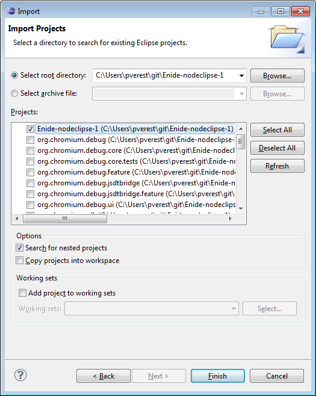

## Developing

### First tiny steps

1. Register & login within [GitHub](https://github.com/Nodeclipse)
2. Add stars to the projects, that you like
3. Fork to your account, learn the code 

### Before starting development, please do

3. Raise an issue to contact developers
4. Say what you are going to do, before you head in. Share and discuss ideas.  
 (We had pull request that we could not merge, because it was not compatible with changes we were going to make.)
1. Carefully read materials (this README)
2. Install and give thorough try

### Preparing environment

#### Clone using Eclipse EGit

In Eclipse with PDE (e.g. Eclipse SDK/Classic, for RCP developers)

1. Copy to clipboard git repository URL: <code>https://github.com/Nodeclipse/nodeclipse-1.git</code>
2. File -> Import.. -> Git / Project from git

##### Clone using git

1. <code>git clone https://github.com/Nodeclipse/nodeclipse-1.git</code>
2. File -> Import -> Existing Projects into Workspace
3. Enter cloned folder path to [Select root directory]. 
4. Check "Search for nested project"  

5. Press "Deselect All" button, and select only base project and `org.nodeclipse.ui`, `org.nodeclipse.debug`
 (or more when you know you need them)

4. Push [Finish] button.

### Eclipse build

Build starts automatically when you import into workspace
 and whenever you save changes (incremental build).

If you are using Enide Studio it should be OK.

If you got build error, probably you have not installed JSDT yet. Try following steps:

1. Select [Help]-[Install New Software...].
2. Select [Juno - http://download.eclipse.org/releases/juno] 
 or [Kepler - http://download.eclipse.org/releases/kepler] in [Work with] drop-down list.
3. Check [Web, XML, Java EE and OSGi Enterprise Development]-[JavaScript Development Tools].

### Maven build

(see also Maven build in README.md in base)

### How to Run or Debug it

1. Select project folder, for instance org.nodeclipse.ui, on Package Explorer.
2. Open context menu by right-clicking.
3. Select [Run As / Debug As]-[Eclipse Application].

A new Eclipse workbench starts with Nodeclipse version that you started to run or debug.
